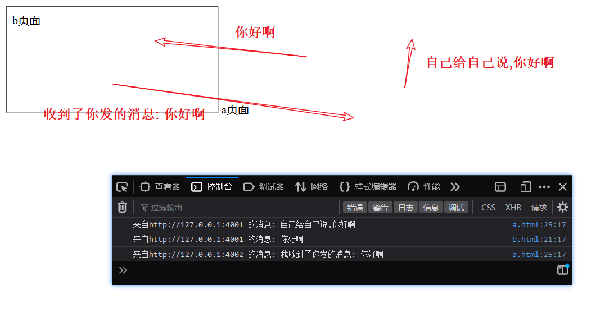
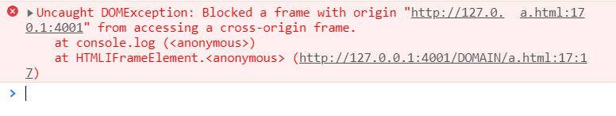
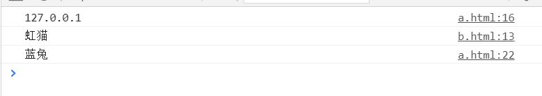
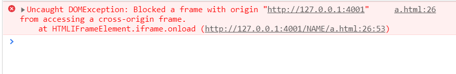
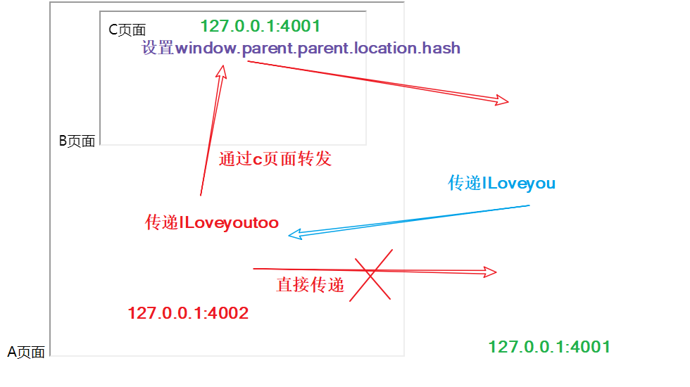

## 准备工作

下面测试用的网页使用如下方式打开

```javascript
const express = require('express');
const path = require('path');
const appA = express();
const appB = express();

appA.use(express.static(path.resolve(__dirname, '../')));
appB.use(express.static(path.resolve(__dirname, '../')));

appA.listen(4001, () => {
  console.log('4001启动');
});
appB.listen(4002, () => {
  console.log('4002启动');
});
```

## window.postMessage()

```javascript
otherWindow.postMessage(message, targetOrigin, [transfer]);
```

`otherWindow` 是其他窗口的一个引用,这里举例使用的是 iframe 的`contentWindow`

### 主页面

```html
<iframe src="http://127.0.0.1:4002/postMessage/b.html"></iframe>
a页面
<script>
  const iframe = document.getElementsByTagName('iframe')[0];

  iframe.onload = () => {
    iframe.contentWindow.postMessage('你好啊', 'http://127.0.0.1:4002/');

    //下面这种不行
    // window.postMessage('你好啊', 'http://127.0.0.1:4002/');
  };

  //不过可以在自己这发给自己
  window.postMessage('自己给自己说,你好啊', 'http://127.0.0.1:4001/');

  window.addEventListener('message', (event) => {
    console.log(`来自${event.origin} 的消息: ${event.data}`);
  });
</script>
```

### 子页面

```html
b页面
<script>
  window.addEventListener('message', (event) => {
    //是否能信任该源
    if (event.origin !== 'http://127.0.0.1:4001') return;
    event.source.postMessage(`我收到了你发的消息: ${event.data}`, event.origin);
  });

  window.addEventListener('message', (event) => {
    console.log(`来自${event.origin} 的消息: ${event.data}`);
  });
</script>
```

### 效果



## document.domain 和 iframe

::: tip 原理
`document.domain`相同或者拥有同一个主域名即可实现通信  
localhost 和 127.0.0.1 是不同的  
出于安全,当前域名是 qq.com,`document.domain`无法设置成 baidu.com,但是可以是 zone.qq.com  
:::

当直接操作 iframe 时会出现这样的错误



实际想得到的效果



### 主页面

```html {7}
<iframe id="iframe" src="http://127.0.0.1:4002/DOMAIN/b.html"></iframe>
a页面
<script>
  const iframe = document.getElementById('iframe');

  //看起来没用,没有却会出错
  document.domain = document.domain;
  console.log(document.domain);

  const user = '虹猫';
  window.user = user;

  iframe.onload = () => {
    console.log(iframe.contentWindow.user);
  };
</script>
```

### iframe 页面

```javascript
document.domain = document.domain;

console.log(window.parent.user);

window.user = '蓝兔';
```

## window.name 和 iframe

::: tip 原理
一个窗口(window)的生命周期内,窗口载入的所有的页面都是共享一个 `window.name` 的，每个页面对 `window.name` 都有读写的权限，`window.name` 是持久存在一个窗口载入过的所有页面中的  
读取同源的 name 可以,不同源的不行,那只要把 src 改成同源即可  
:::

出现跨域问题时



### 数据页面

不同源 `http://127.0.0.1:4002/NAME/b.html`

```javascript
const json = { name: 'catlair' };
window.name = JSON.stringify(json);
```

### 代理页面

同源 `http://127.0.0.1:4001/NAME/proxy.html`

```html
<html></html>
```

### 主页面

`http://127.0.0.1:4001/NAME/a.html`

```javascript
const iframe = document.createElement('iframe');
//先让iframe加载指定页面,获取name
iframe.src = 'http://127.0.0.1:4002/NAME/b.html';
iframe.style.display = 'none';
document.body.appendChild(iframe);
let count = 0;

iframe.onload = () => {
  //count = 0表示第一次进入onload,改变src为同源
  //然后count++
  if (!count++) {
    iframe.src = 'http://127.0.0.1:4001/NAME/proxy.html';
  } else {
    //来到这里说明count>0,即已经加载同源了
    //可以读取name值
    console.log(JSON.parse(iframe.contentWindow.name));
    document.body.removeChild(iframe);
  }
};
```

## location.hash 和 iframe

::: tip 原理  
A 页面可以传递 hash 给子页面 B,但是由于跨域,B 无法修改 A 的 hash

- A 的子页面 B
- B 的子页面 C
- A 和 C 同源
- A 和 B 非同源

B 可以传给 C,C 再传递给 A  
:::



### A 4001

```html
<iframe src="http://127.0.0.1:4002/HASH/b.html#Iloveyou" id="frame"></iframe>
```

```javascript
// 使用 hashchange 事件接收来自 C 页面设置给 A 页面的 hash 值
window.onhashchange = function() {
  if (location.hash === '') return;
  console.log(location.hash);
  alert(location.hash);
  location.hash = '';
};
```

### B 4002

```javascript
// 打印 A 页面引入 B 页面设置的 hash 值
console.log(location.hash);
//这样直接设置会出现跨域
// window.parent.location.hash = '#ILoveyoutoo';
let iframe = document.createElement('iframe');
iframe.src = 'http://127.0.0.1:4001/HASH/c.html#Iloveyoutoo';
document.body.appendChild(iframe);
```

### C 4001

```javascript
// 将 C 页面引入 B 页面设置的 hash 值设置给 A页面
window.parent.parent.location.hash = location.hash;
```
