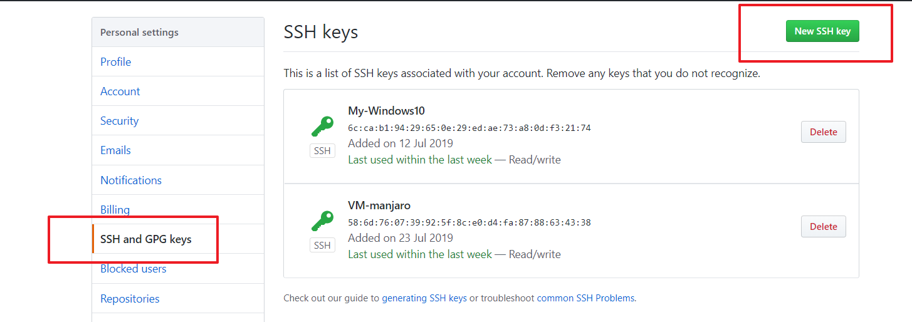
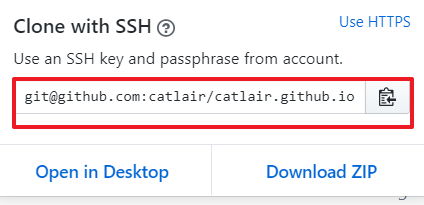
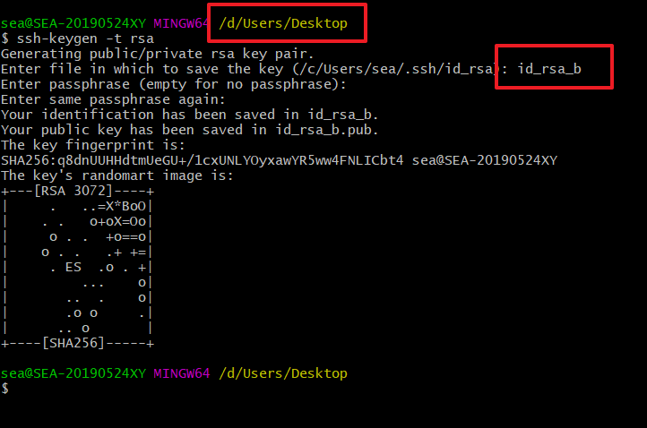

## 普通情况一个密钥,几个平台,每个平台只有一个账号

### 获取密钥对

```bash
# ssh-keygen -t rsa       <== 建立密钥对，-t代表类型，有RSA和DSA两种
```

> 关于加`-C "邮箱"`有什么用  
> [参考这里](https://blog.csdn.net/u011118321/article/details/78516303)
>
> > -t = The type of the key to generate  
> > 密钥的类型  
> > -C = comment to identify the key  
> > 用于识别这个密钥的注释  
> > 按照这个来说基本没意义.不加他会生成计算机名

输入后一直回车操作即可

然后会在`~/.ssh`或者说`C盘\用户\用户名\.ssh`文件夹中生成两个文件  
`id_rsa`和`id_rsa.pub`  
前者是私钥,后者是公钥.

打开公钥包`id_rsa.pub`,复制里面的公钥粘贴到需要的地方,比如 github  
  
可以直接用本机和远程无需账号密码连接了.  
  
这个密钥传到 github 同时也可以传到其他地方,都是能用的,但不能传到另一个 github 账号.

## 我几个托管平台平台不想用一个密钥对

目前我没这想法

## 我想一台电脑用 ssh 链接两个 github 或者其他托管平台

1. 首先当然是生成密钥

```bash
# ssh-keygen -t rsa
```

> 注意：既然你有两个 github 账号，因此在生成 ssh key 时需要注意保存的两个 key 的文件名要注意区别，比如第一个账号：生成的文件名为 id_rsa，第二个叫 id_rsa_a,这样就可以加以区分。(名字按照习惯取吧)

第一个密钥我就按默认生成吧(懒).  
第二个密钥注意  
  
第一个红框是所在位置,第二个地方是要求输入`密钥生成地址及其名称`,默认是前面括号中的,这里我只输入名称,地址为当前所在位置(桌面).生成后复制到`~/.ssh`就可以  
(因为 Windows 的问题我不敢输入太多不然后果可能如下)


2. 分别添加公钥到两个 github 账号

3. 配置 config 文件

在{USER_HOME}/.ssh/目录下，新建一个 config 文件，在文件中添加如下内容：

```config
# For me
Host github.com
  HostName github.com
  PreferredAuthentications publickey
  IdentityFile ~/.ssh/id_rsa

# For work
Host work_github
  HostName github.com
  PreferredAuthentications publickey
  IdentityFile ~/.ssh/id_rsa_a
```

以上内容，需要根据自己的文件进行相应的修改；  
Host 名称可以按喜好修改  
HostName 平台地址(github 是 github.com)
IdentityFile 私钥文件

4. 测试

```bash
$ ssh -T git@github.com
Warning: Permanently added the RSA host key for IP address '13.250.177.223' to the list of known hosts.
Hi aitlp! You've successfully authenticated, but GitHub does not provide shell access.

Michael@DESKTOP-BL9MF61 MINGW64 ~/.ssh
$ ssh -T git@work_github
Hi weiyanzixun! You've successfully authenticated, but GitHub does not provide shell access.
```

Hi 某某 ! ... 表示成功连接

5. 修改使用的链接

第一个写的`Host github.com`不需要修改任何东西.

第二个写的`Host work_github`需要修改

github 的链接都改成这个样式  
`git@work_github:aitlp/Spark.git`  
就是把`github.com替换成work_github`

最后,第一个我只是用来演示对比的,实际他会默认使用`id_rsa`,所以名字不做修改的不用任何变化(即不需要 3,5 步骤).
